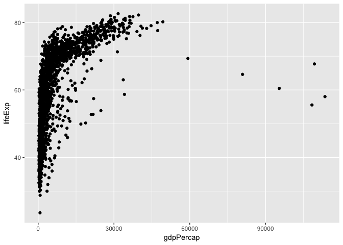

A deeper exploration into Gapminder Dataset
================
Jason Sun
2017-09-25

Intro
-----

Last time during homework 01, I have showed you the most fundmental aspects of gapminder, which is a very basic dataset for entry level people to better explore R. We see the general form of it, which is a two-dimensional table with 6 attributes and 1704 lines of data. Today, we will dig a little deeper as we are becoming more and more professional in R :)

This page will be divided into the following aspects: - Overall Property of the Dataset - Variable Property Exploration - Data Visualization using ggplot2 - Data Filtering with limited conditions to get desired information - Personal Thought about this work

Overall Property of Gapminder
-----------------------------

We need to load the Gapminder first

``` r
library(gapminder)
library(tidyverse)
```

    ## Loading tidyverse: ggplot2
    ## Loading tidyverse: tibble
    ## Loading tidyverse: tidyr
    ## Loading tidyverse: readr
    ## Loading tidyverse: purrr
    ## Loading tidyverse: dplyr

    ## Conflicts with tidy packages ----------------------------------------------

    ## filter(): dplyr, stats
    ## lag():    dplyr, stats

``` r
library(ggplot2)
```

So the first question we are going to answer is what is Gapminder? Is it a data.frame, a matrix, a vector, a list? Well, we can check it by using typeof() function in R. Let's try it out!

``` r
typeof(gapminder)
```

    ## [1] "list"

Wow, it seems it is a list data type. Then what is its class?

``` r
class(gapminder)
```

    ## [1] "tbl_df"     "tbl"        "data.frame"

Hmm, it is a Dataframe.

So next, How many variables/columns do we have? We can use ncol in R

``` r
ncol(gapminder)
```

    ## [1] 6

Then how many rows/observations do we have? We can use nrow in R

``` r
nrow(gapminder)
```

    ## [1] 1704

So next I will show you some different tricks about how to find out the extent and size of the dataset

To find the length of the dataset

``` r
length(gapminder)
```

    ## [1] 6

To give a dimension of the dataset

``` r
dim(gapminder)
```

    ## [1] 1704    6

To give the names of all the columns

``` r
names(gapminder)
```

    ## [1] "country"   "continent" "year"      "lifeExp"   "pop"       "gdpPercap"

Let's have a final statistical overview of the dataset

``` r
summary(gapminder)
```

    ##         country        continent        year         lifeExp     
    ##  Afghanistan:  12   Africa  :624   Min.   :1952   Min.   :23.60  
    ##  Albania    :  12   Americas:300   1st Qu.:1966   1st Qu.:48.20  
    ##  Algeria    :  12   Asia    :396   Median :1980   Median :60.71  
    ##  Angola     :  12   Europe  :360   Mean   :1980   Mean   :59.47  
    ##  Argentina  :  12   Oceania : 24   3rd Qu.:1993   3rd Qu.:70.85  
    ##  Australia  :  12                  Max.   :2007   Max.   :82.60  
    ##  (Other)    :1632                                                
    ##       pop              gdpPercap       
    ##  Min.   :6.001e+04   Min.   :   241.2  
    ##  1st Qu.:2.794e+06   1st Qu.:  1202.1  
    ##  Median :7.024e+06   Median :  3531.8  
    ##  Mean   :2.960e+07   Mean   :  7215.3  
    ##  3rd Qu.:1.959e+07   3rd Qu.:  9325.5  
    ##  Max.   :1.319e+09   Max.   :113523.1  
    ## 

Now let's find out the data type of each variable in the dataset

``` r
typeof(gapminder$country)
```

    ## [1] "integer"

``` r
typeof(gapminder$continent)
```

    ## [1] "integer"

``` r
typeof(gapminder$year)
```

    ## [1] "integer"

``` r
typeof(gapminder$lifeExp)
```

    ## [1] "double"

``` r
typeof(gapminder$pop)
```

    ## [1] "integer"

``` r
typeof(gapminder$gdpPercap)
```

    ## [1] "double"

Next we will explore one categorical variable and one quantative variable. The categorical data we pick up will be the year variable Let's get a summary of year first:

``` r
summary(gapminder$year)
```

    ##    Min. 1st Qu.  Median    Mean 3rd Qu.    Max. 
    ##    1952    1966    1980    1980    1993    2007

``` r
table(gapminder$year)
```

    ## 
    ## 1952 1957 1962 1967 1972 1977 1982 1987 1992 1997 2002 2007 
    ##  142  142  142  142  142  142  142  142  142  142  142  142

So it is quite clear that the year ranges from 1952 to 2007 and median value is 1980 and mean value is also 1980

Let's also take a look at the quantative variable lifeExp

``` r
summary(gapminder$lifeExp)
```

    ##    Min. 1st Qu.  Median    Mean 3rd Qu.    Max. 
    ##   23.60   48.20   60.71   59.47   70.85   82.60

``` r
hist(gapminder$lifeExp)
```

 From the histgram we can see that the 70~75 takes up most of the life expectency and max lifeExp is 82.6 and Min is 23.6 where median is 60.71.

Plot Exploration with ggplot2 for Gapminder
-------------------------------------------

Let's try to see the scatterplot for the relationship between lifeExp and gdpPercap

``` r
ggplot(gapminder, aes(x = gdpPercap, y = lifeExp)) + geom_point()
```



Let's try to find out the log10(gdpPerCap) towards lifeExp

``` r
ggplot(gapminder, aes(x = log10(gdpPercap), y = lifeExp)) + geom_point()
```


Let's try to plot a quantative variable lifeExp and make a histogram of it

``` r
hist(gapminder$lifeExp)
```


Now Let's try something interesting. How about we draw a plot by year with different countries and their respective lifeExp? Would that be difficult?

``` r
jCountries <- c("Canada", "Rwanda", "Cambodia", "Mexico")
ggplot(subset(gapminder, country %in% jCountries), aes(x = year, y = lifeExp, color = country)) + geom_line() + geom_point()
```


Filtering and Selecting
-----------------------

Sometimes we don't need to use all the data provided. So we will need to filter and select the data that we want. R has provided us with some really useful functions that can easily help to do the filtering. Let's take some real examples. For example, if we want to plot a lifeExp graph with ony country of Canada in ggplot2, how could we do that? We can add a parameter called filter in ggplot to assgin the country to Canada then that's it!

``` r
suppressPackageStartupMessages(library(dplyr))
ggplot(gapminder %>% filter(country == "Canada"), aes(x = year, y = lifeExp)) + geom_line() + geom_point()
```


Cool! So how about using the filter() and select() together to plot the lifeExp by year for Rwanda? Let's try this:

``` r
filter(gapminder, country == c("Rwanda")) %>%select(year, lifeExp) %>%ggplot(aes(x=year, y=lifeExp))+ geom_line() + geom_point()
```


Wops, there seems to be a drastic drop in 1991 where the lifeExp is below 25, which I think may be a mistake I guess..

Some thoughts
-------------

Homework2 is a little harder than homework1 with more things to consider and requires you more proficient in R for data types, plots, common operations, etc. Afterall, it is not so difficult as thought and we can make things better in the next homework assignment.
