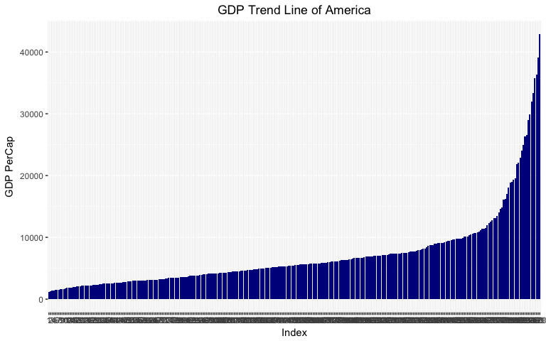
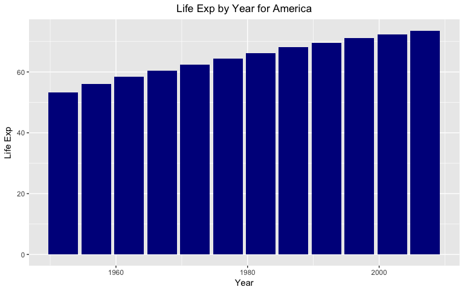

Use dplyr and ggplot2 to manipulate and explore gapminder dataset
================
Jason Sun
2017-10-02

Intro
-----

Today we will use some common functions in ggplot2 and dplyr to dive deeper into the gapminder dataset

This page will be divided into the following aspects: - Get the maximum and minimum of GDP per capita for all continents.

-   Look at the spread of GDP per capita within the continents

-   Compute a trimmed mean of life expectancy for different years. Or a weighted mean, weighting by population. Just try something other than the plain vanilla mean

-   Find out the life expectancy changing over time on different continents

-   Report the absolute and/or relative abundance of countries with low life expectancy over time by continent: Compute some measure of worldwide life expectancy by mean or median or some other quantile or perhaps your current age. Then determine how many countries on each continent have a life expectancy less than this benchmark, for each year

-   Find countries with interesting stories. Open-ended and, therefore, hard. Promising but unsuccessful attempts are encouraged. This will generate interesting questions to follow up on in class

Initial Setup
-------------

We need to load the Gapminder first

``` r
library(gapminder)
library(tidyverse)
```

    ## Loading tidyverse: ggplot2
    ## Loading tidyverse: tibble
    ## Loading tidyverse: tidyr
    ## Loading tidyverse: readr
    ## Loading tidyverse: purrr
    ## Loading tidyverse: dplyr

    ## Conflicts with tidy packages ----------------------------------------------

    ## filter(): dplyr, stats
    ## lag():    dplyr, stats

``` r
library(ggplot2)
knitr::opts_chunk$set(fig.width=8, fig.height=5)
```

Do some work
------------

### Question1: Get the maximum and minimum of GDP per capita for all continents

Wow, I got to say the first question is a little bit tricky :( and let 's figure it out step by step.

So we first groupby gapminder by continents

Then we extract the max and min from column gdpPercap. Done

``` r
gdpper <- gapminder %>% group_by(continent) %>% summarize(maximum_gdpPercap=max(gdpPercap), minimum_gdpPercap=min(gdpPercap))
```

We can use a histogram to draw the table to show the results of maximum GDP.

``` r
ggplot(gdpper, aes(gdpper$continent, gdpper$maximum_gdpPercap, fill=gdpper$continent)) + geom_bar(stat="identity",position="dodge")+geom_text(aes(label=gdpper$maximum_gdpPercap),position=position_dodge(width=0.9), vjust=-0.25)
```


Quite astonishing right? It is an Asia country who has the most GDP per capita, which is Qatar.

We can use a histogram to draw the table to show the results of minimum GDP.

``` r
ggplot(gdpper, aes(gdpper$continent, gdpper$minimum_gdpPercap, fill=gdpper$continent)) + geom_bar(stat="identity",position="dodge")+geom_text(aes(label=gdpper$minimum_gdpPercap),position=position_dodge(width=0.9), vjust=-0.25)
```


Hmm, It is quite clear that Africa indeed has the lowest GDP.

BTW, so if we want the data of continents by year?

``` r
gapminder %>% group_by(continent, year) %>% summarise_each(funs(min, max), gdpPercap)
```

    ## `summarise_each()` is deprecated.
    ## Use `summarise_all()`, `summarise_at()` or `summarise_if()` instead.
    ## To map `funs` over a selection of variables, use `summarise_at()`

    ## # A tibble: 60 x 4
    ## # Groups:   continent [?]
    ##    continent  year gdpPercap_min gdpPercap_max
    ##       <fctr> <int>         <dbl>         <dbl>
    ##  1    Africa  1952      298.8462      4725.296
    ##  2    Africa  1957      335.9971      5487.104
    ##  3    Africa  1962      355.2032      6757.031
    ##  4    Africa  1967      412.9775     18772.752
    ##  5    Africa  1972      464.0995     21011.497
    ##  6    Africa  1977      502.3197     21951.212
    ##  7    Africa  1982      462.2114     17364.275
    ##  8    Africa  1987      389.8762     11864.408
    ##  9    Africa  1992      410.8968     13522.158
    ## 10    Africa  1997      312.1884     14722.842
    ## # ... with 50 more rows

### Question2: Look at the spread of GDP per capita within the continents

We also need to groupby the gapminder by continents and then create subview in (continent, gdpPercap), then filter by continents and then do respective summary()

For Asia

``` r
asia<-gapminder %>% group_by(continent) %>% select(continent, gdpPercap) %>% filter(continent=="Asia")%>%arrange(gdpPercap)
ggplot(asia, aes(x=row.names(asia), y = asia$gdpPercap, group=1)) + geom_bar(stat="identity",position="dodge", fill = "dark blue")+labs(x = "Index", y = "GDP PerCap", title = "GDP Trend Line of Asia")+scale_x_discrete(limits= row.names(asia))+ theme(plot.title = element_text(hjust = 0.5))
```


For Europe

``` r
europe<-gapminder %>% group_by(continent) %>% select(continent, gdpPercap) %>% filter(continent=="Europe")%>%arrange(gdpPercap)
ggplot(europe, aes(x=row.names(europe), y = europe$gdpPercap, group=1)) + geom_bar(stat="identity",position="dodge", fill = "dark blue")+labs(x = "Index", y = "GDP PerCap", title = "GDP Trend Line of Europe")+scale_x_discrete(limits= row.names(europe))+ theme(plot.title = element_text(hjust = 0.5))
```


For Africa

``` r
africa<-gapminder %>% group_by(continent) %>% select(continent, gdpPercap) %>% filter(continent=="Africa")%>%arrange(gdpPercap)
ggplot(africa, aes(x=row.names(africa), y = africa$gdpPercap, group=1)) + geom_bar(stat="identity",position="dodge", fill = "dark blue")+labs(x = "Index", y = "GDP PerCap", title = "GDP Trend Line of Africa")+scale_x_discrete(limits= row.names(africa))+ theme(plot.title = element_text(hjust = 0.5))
```



For Americas

``` r
america<-gapminder %>% group_by(continent) %>% select(continent, gdpPercap) %>% filter(continent=="Americas")%>%arrange(gdpPercap)
ggplot(america, aes(x=row.names(america), y = america$gdpPercap, group=1)) + geom_bar(stat="identity",position="dodge", fill = "dark blue")+labs(x = "Index", y = "GDP PerCap", title = "GDP Trend Line of America")+scale_x_discrete(limits= row.names(america))+ theme(plot.title = element_text(hjust = 0.5))
```


For Oceania

``` r
oceania<-gapminder %>% group_by(continent) %>% select(continent, gdpPercap) %>% filter(continent=="Oceania")%>%arrange(gdpPercap)
ggplot(oceania, aes(x=row.names(oceania), y = oceania$gdpPercap, group=1)) + geom_bar(stat="identity",position="dodge", fill = "dark blue")+labs(x = "Index", y = "GDP PerCap", title = "GDP Trend Line of Oceania")+scale_x_discrete(limits= row.names(oceania))+ theme(plot.title = element_text(hjust = 0.5))
```


### Question3: Compute a trimmed mean of life expectancy for different years.

How to compute a trimmed mean of life expectancy for different years? Let's take the trim value = 0.1 for example

``` r
years <- gapminder %>% group_by(year) %>% select(year, lifeExp) %>% summarise_each(funs(mean(lifeExp, trim=0.1)), lifeExp)
```

    ## `summarise_each()` is deprecated.
    ## Use `summarise_all()`, `summarise_at()` or `summarise_if()` instead.
    ## To map `funs` over a selection of variables, use `summarise_at()`

``` r
ggplot(years, aes(x=year, y = lifeExp)) + geom_bar(stat="identity",position="dodge",fill = "Red")+labs(x = "Year", y = "Life Exp", title = "Life Exp by Year") + theme(plot.title = element_text(hjust = 0.5))
```


It is quite clear that the life exp increases steadily year by year.

### Question4: How is life expectancy changing over time on different continents?

Then we need to get all the life expectancy data by contients, groupby year and then get the average life expectany of the year, then we draw the plot and then we can see the tendency of changes

This is for Asia

``` r
asialifeexp <- gapminder %>% select(continent, year, lifeExp) %>% filter(continent=="Asia") %>% group_by(year) %>% summarize(avg_life_exp = mean(lifeExp))
ggplot(asialifeexp, aes(x=year, y = avg_life_exp)) + geom_bar(stat="identity",position="dodge",fill = "dark blue")+labs(x = "Year", y = "Life Exp", title = "Life Exp by Year for Asia") + theme(plot.title = element_text(hjust = 0.5))
```


This is for Americas

``` r
americalifeexp <- gapminder %>% select(continent, year, lifeExp) %>% filter(continent=="Americas") %>% group_by(year) %>% summarize(avg_life_exp = mean(lifeExp))
ggplot(americalifeexp, aes(x=year, y = avg_life_exp)) + geom_bar(stat="identity",position="dodge",fill = "dark blue")+labs(x = "Year", y = "Life Exp", title = "Life Exp by Year for America") + theme(plot.title = element_text(hjust = 0.5))
```


This is for Africa

``` r
africalifeexp <- gapminder %>% select(continent, year, lifeExp) %>% filter(continent=="Africa") %>% group_by(year) %>% summarize(avg_life_exp = mean(lifeExp))
ggplot(africalifeexp, aes(x=year, y = avg_life_exp)) + geom_bar(stat="identity",position="dodge",fill = "dark blue")+labs(x = "Year", y = "Life Exp", title = "Life Exp by Year for Africa") + theme(plot.title = element_text(hjust = 0.5))
```



For Oceania

``` r
oceanialifeexp <- gapminder %>% select(continent, year, lifeExp) %>% filter(continent=="Oceania") %>% group_by(year) %>% summarize(avg_life_exp = mean(lifeExp))
ggplot(oceanialifeexp, aes(x=year, y = avg_life_exp)) + geom_bar(stat="identity",position="dodge",fill = "dark blue")+labs(x = "Year", y = "Life Exp", title = "Life Exp by Year for Oceania") + theme(plot.title = element_text(hjust = 0.5))
```


For Europe

``` r
europelifeexp <- gapminder %>% select(continent, year, lifeExp) %>% filter(continent=="Europe") %>% group_by(year) %>% summarize(avg_life_exp = mean(lifeExp))
ggplot(oceanialifeexp, aes(x=year, y = avg_life_exp)) + geom_bar(stat="identity",position="dodge",fill = "dark blue")+labs(x = "Year", y = "Life Exp", title = "Life Exp by Year for Europe") + theme(plot.title = element_text(hjust = 0.5))
```


### Question 5: Find countries whose life expectancy is lower than the average of the world

First we need to compute the average life expectancy of the world for all the years together.

``` r
avg_life <- mean(gapminder$lifeExp)
avg_life
```

    ## [1] 59.47444

Let's then calculate the average life expectancy of countries one by one whose is below the avg\_life calculated above

``` r
gapminder%>%group_by(country, continent)%>%summarize(avg_life_exp = mean(lifeExp))%>%filter(avg_life_exp < avg_life)%>%arrange(continent)%>%group_by(continent)%>%summarize(n = n())
```

    ## # A tibble: 3 x 2
    ##   continent     n
    ##      <fctr> <int>
    ## 1    Africa    49
    ## 2  Americas     6
    ## 3      Asia    15

Wow, it seems that there are total of 70 countries who is under average life exp and Africa accounts for over 81.6% of the total.

### Question 6: Find countries with interesting stories. Open-ended and, therefore, hard. Promising but unsuccessful attempts are encouraged. This will generate interesting questions to follow up on in class

Let's see what countries do we have

``` r
gapminder$country%>%unique()
```

    ##   [1] Afghanistan              Albania                 
    ##   [3] Algeria                  Angola                  
    ##   [5] Argentina                Australia               
    ##   [7] Austria                  Bahrain                 
    ##   [9] Bangladesh               Belgium                 
    ##  [11] Benin                    Bolivia                 
    ##  [13] Bosnia and Herzegovina   Botswana                
    ##  [15] Brazil                   Bulgaria                
    ##  [17] Burkina Faso             Burundi                 
    ##  [19] Cambodia                 Cameroon                
    ##  [21] Canada                   Central African Republic
    ##  [23] Chad                     Chile                   
    ##  [25] China                    Colombia                
    ##  [27] Comoros                  Congo, Dem. Rep.        
    ##  [29] Congo, Rep.              Costa Rica              
    ##  [31] Cote d'Ivoire            Croatia                 
    ##  [33] Cuba                     Czech Republic          
    ##  [35] Denmark                  Djibouti                
    ##  [37] Dominican Republic       Ecuador                 
    ##  [39] Egypt                    El Salvador             
    ##  [41] Equatorial Guinea        Eritrea                 
    ##  [43] Ethiopia                 Finland                 
    ##  [45] France                   Gabon                   
    ##  [47] Gambia                   Germany                 
    ##  [49] Ghana                    Greece                  
    ##  [51] Guatemala                Guinea                  
    ##  [53] Guinea-Bissau            Haiti                   
    ##  [55] Honduras                 Hong Kong, China        
    ##  [57] Hungary                  Iceland                 
    ##  [59] India                    Indonesia               
    ##  [61] Iran                     Iraq                    
    ##  [63] Ireland                  Israel                  
    ##  [65] Italy                    Jamaica                 
    ##  [67] Japan                    Jordan                  
    ##  [69] Kenya                    Korea, Dem. Rep.        
    ##  [71] Korea, Rep.              Kuwait                  
    ##  [73] Lebanon                  Lesotho                 
    ##  [75] Liberia                  Libya                   
    ##  [77] Madagascar               Malawi                  
    ##  [79] Malaysia                 Mali                    
    ##  [81] Mauritania               Mauritius               
    ##  [83] Mexico                   Mongolia                
    ##  [85] Montenegro               Morocco                 
    ##  [87] Mozambique               Myanmar                 
    ##  [89] Namibia                  Nepal                   
    ##  [91] Netherlands              New Zealand             
    ##  [93] Nicaragua                Niger                   
    ##  [95] Nigeria                  Norway                  
    ##  [97] Oman                     Pakistan                
    ##  [99] Panama                   Paraguay                
    ## [101] Peru                     Philippines             
    ## [103] Poland                   Portugal                
    ## [105] Puerto Rico              Reunion                 
    ## [107] Romania                  Rwanda                  
    ## [109] Sao Tome and Principe    Saudi Arabia            
    ## [111] Senegal                  Serbia                  
    ## [113] Sierra Leone             Singapore               
    ## [115] Slovak Republic          Slovenia                
    ## [117] Somalia                  South Africa            
    ## [119] Spain                    Sri Lanka               
    ## [121] Sudan                    Swaziland               
    ## [123] Sweden                   Switzerland             
    ## [125] Syria                    Taiwan                  
    ## [127] Tanzania                 Thailand                
    ## [129] Togo                     Trinidad and Tobago     
    ## [131] Tunisia                  Turkey                  
    ## [133] Uganda                   United Kingdom          
    ## [135] United States            Uruguay                 
    ## [137] Venezuela                Vietnam                 
    ## [139] West Bank and Gaza       Yemen, Rep.             
    ## [141] Zambia                   Zimbabwe                
    ## 142 Levels: Afghanistan Albania Algeria Angola Argentina ... Zimbabwe

Let's see which country has the highest gdpPercapita by mean, which means that the country is more wealthy in from a general perspective.

``` r
gapminder%>%select(country, pop, gdpPercap, year) %>% group_by(country) %>% summarize(population = mean(pop), gdp_percapita = mean(gdpPercap)) %>% arrange(desc(gdp_percapita)) %>% head()
```

    ## # A tibble: 6 x 3
    ##         country population gdp_percapita
    ##          <fctr>      <dbl>         <dbl>
    ## 1        Kuwait    1206496      65332.91
    ## 2   Switzerland    6384293      27074.33
    ## 3        Norway    4031441      26747.31
    ## 4 United States  228211232      26261.15
    ## 5        Canada   24462967      22410.75
    ## 6   Netherlands   13786798      21748.85

Wow, it is Kuwait which enjoys the highest GDP. So let's see the detailed timeline for tendency.

``` r
a<-gapminder%>%filter(country=="Kuwait")%>%select(year, gdpPercap, pop)
ggplot(a, aes(x=year, y = gdpPercap, color=year)) + geom_line() + geom_point()
```

 It is quite interesting that the GDP was quite high in 1950s but in drastically droped between 1970 to 1980 and then slowly recovered... Let's add the population into consideration to see whether it has anything to do with the drop.

We need to do the normalization first by using scale() becasue the popluation number is much larger than the GDP value.

``` r
ggplot(a, aes(x=year)) + geom_point(aes(y=scale(gdpPercap)), ) + geom_line(aes(y=scale(gdpPercap),  color="red")) + geom_point(aes(y=scale(pop))) + geom_line(aes(y=scale(pop)), color = "blue") + labs(title="GDP Change with respective to time and population for Kuwait") + labs(caption="(based on normalized data)")
```


It is quite interesting that the GDP dropped drastically with the soaring growth of human population. Maybe becasue as we all know that during 1970 to 1990, Kuwait had war with Iraq and Iran, which crashed its economy. Maybe that is the reason. It is quite an interesting fact to find how fragile the GDP, or economy is of a country.

Personal Thought
----------------

It is quite clear that hw03 is harder than hw02 and I really spent some time in working on how to plan the piping and how to plot the graph in a more effective way. I like the notion of piping because it is much like the "&gt;" and "||" in Linux and make data handling much easier with linear thinking. No more loops or iterative function to think about and just a couple of simple steps makes the whole process much easier.

Furthermore, I found how to plot the graph is an art and it indeed requires more experience such as how to choose the right type of graph to show your idea in most effective way. How to handle different data ranges in a single graph, how to do the data normalization? It is an interesting topic to think and learn in the long run.
