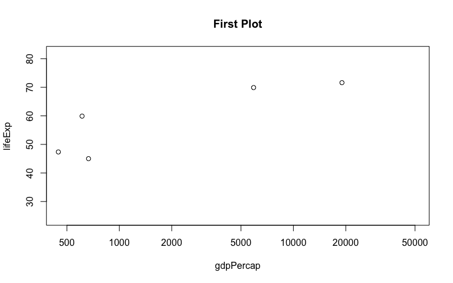

Tidy data and joins
================
Jason Sun
2017-10-18

Intro
-----

Today we will try to Factor and figure management

This page will be divided into the following aspects:

-   Reorder a factor in a principled way based on the data and demonstrate the effect in arranged data and in figures.

-   Experiment with one or more of write\_csv()/read\_csv() (and/or TSV friends), saveRDS()/readRDS(), dput()/dget()

-   Improve a figure (or make one from scratch), using new knowledge, e.g., control the color scheme, use factor levels, smoother mechanics.

-   Implement visualization design principles.

-   Write some data to file and load it back into R. E.g., save a plot to file and include it in a R Markdown report via.

-   Organise your github, to celebrate the completion of STAT 545 and/or to prepare for the glorious future of STAT 547.

Initial Setup
-------------

We need to load the Gapminder first

``` r
suppressPackageStartupMessages(library(gapminder))
suppressPackageStartupMessages(library(tidyverse))
```

    ## Warning: package 'dplyr' was built under R version 3.4.2

``` r
suppressPackageStartupMessages(library(dplyr))
suppressPackageStartupMessages(library(ggplot2))
suppressPackageStartupMessages(library(reshape))
suppressPackageStartupMessages(library(tidyr))
library(forcats)
library(gapminder)
library(tidyverse)
library(ggplot2)
library(knitr)
library(ggthemes)
library(reshape)
library(tidyr)
knitr::opts_chunk$set(fig.width=8, fig.height=5)
```

Let's do some work buddy!
-------------------------

### Question 1: Reorder a factor in a principled way based on the data and demonstrate the effect in arranged data and in figures

I will still use gapminder dataset to do the data maniuputation because that is my most familiar dataset :)

So regarding how to reorder the factor in a principled way. Here is three steps as recommended in class:

-   Define factor variables
-   Drop factor / levels
-   Reorder levels based on knowledge from data

So for the gapminder dataset, we will do this:

-   Filter the Gapminder data to remove observations associated with the continent of Oceania.

-   Additionally, remove unused factor levels. Provide concrete information on the data before and after removing these rows and Oceania;

-   Address the number of rows and the levels of the affected factors.

-   Reorder the levels of country or continent. Use the forcats package to change the order of the factor levels, based on a principled summary of one of the quantitative variables

Let's Go!

**Step1: Filter the Gapminder data to remove observations associated with the continent of Oceania**

``` r
h_continents <- c("Africa", "Asia", "Europe", "Americas")
h_result <- gapminder %>% filter(continent %in% h_continents)
h_result
```

    ## # A tibble: 1,680 x 6
    ##        country continent  year lifeExp      pop gdpPercap
    ##         <fctr>    <fctr> <int>   <dbl>    <int>     <dbl>
    ##  1 Afghanistan      Asia  1952  28.801  8425333  779.4453
    ##  2 Afghanistan      Asia  1957  30.332  9240934  820.8530
    ##  3 Afghanistan      Asia  1962  31.997 10267083  853.1007
    ##  4 Afghanistan      Asia  1967  34.020 11537966  836.1971
    ##  5 Afghanistan      Asia  1972  36.088 13079460  739.9811
    ##  6 Afghanistan      Asia  1977  38.438 14880372  786.1134
    ##  7 Afghanistan      Asia  1982  39.854 12881816  978.0114
    ##  8 Afghanistan      Asia  1987  40.822 13867957  852.3959
    ##  9 Afghanistan      Asia  1992  41.674 16317921  649.3414
    ## 10 Afghanistan      Asia  1997  41.763 22227415  635.3414
    ## # ... with 1,670 more rows

Then it is quite clear that we have already filtered the Oceania out of the scope for now.

**Step2: Remove unused factor levels. Provide concrete information on the data before and after removing these rows and Oceania**

So we will use droplevels() to drop the unnecessary info from h\_result

``` r
temp <- h_result%>%droplevels()
nlevels(h_result$continent)
```

    ## [1] 5

``` r
nlevels(temp$continent)
```

    ## [1] 4

See? the h\_result still have 5 and after the droplevels() function applied, the temp is now only 4, which means that it has only 4 factors, where Oceania is now clearly dropped. which clearly shows the difference between them.

**Step3: Address the number of rows and the levels of the affected factors**

Let's see how many rows are deleted when we droplevels() the Oceania? We can use the count() to see the difference

``` r
gapminder %>% count(gapminder$continent)
```

    ## # A tibble: 5 x 2
    ##   `gapminder$continent`     n
    ##                  <fctr> <int>
    ## 1                Africa   624
    ## 2              Americas   300
    ## 3                  Asia   396
    ## 4                Europe   360
    ## 5               Oceania    24

``` r
fct_count(temp$continent)
```

    ## # A tibble: 4 x 2
    ##          f     n
    ##     <fctr> <int>
    ## 1   Africa   624
    ## 2 Americas   300
    ## 3     Asia   396
    ## 4   Europe   360

It is quite clear that 24 rows of Oceania is deleted after using the droplevels()

**Step4: Reorder the levels of country or continent. Use the forcats package to change the order of the factor levels, based on a principled summary of one of the quantitative variables**

So, we will try to change the levels of country by change the order of frequency starting from the largest to the smallest using fct\_infreq() function.

``` r
gapminder$continent %>% fct_infreq() %>% levels() %>% head()
```

    ## [1] "Africa"   "Asia"     "Europe"   "Americas" "Oceania"

### Question 2: Experiment with one or more of write\_csv()/read\_csv() (and/or TSV friends), saveRDS()/readRDS(), dput()/dget() with fiddling with factor levels, and doing some filtering, etc.

So I reorder the country factor levels according to the life expectancy summary we've already computed and then use saveRDS() function to save onto local disk and then using readRDS() to read it from local disk to RAM

``` r
life_exp <- gapminder %>% group_by(country, continent) %>% summarise(life_exp = max(lifeExp)) %>%  ungroup()
```

So the original dataset is like this

``` r
life_exp
```

    ## # A tibble: 142 x 3
    ##        country continent life_exp
    ##         <fctr>    <fctr>    <dbl>
    ##  1 Afghanistan      Asia   43.828
    ##  2     Albania    Europe   76.423
    ##  3     Algeria    Africa   72.301
    ##  4      Angola    Africa   42.731
    ##  5   Argentina  Americas   75.320
    ##  6   Australia   Oceania   81.235
    ##  7     Austria    Europe   79.829
    ##  8     Bahrain      Asia   75.635
    ##  9  Bangladesh      Asia   64.062
    ## 10     Belgium    Europe   79.441
    ## # ... with 132 more rows

Then we do some changing work by reading and saving the dataset.

``` r
write_csv(life_exp, "life_exp.csv")

temp_life_exp <- read_csv("life_exp.csv")
```

    ## Parsed with column specification:
    ## cols(
    ##   country = col_character(),
    ##   continent = col_character(),
    ##   life_exp = col_double()
    ## )

``` r
result <- temp_life_exp %>% mutate(country = fct_reorder(country, life_exp))

head(levels(result$country))
```

    ## [1] "Sierra Leone" "Angola"       "Afghanistan"  "Liberia"     
    ## [5] "Rwanda"       "Mozambique"

``` r
saveRDS(result, "result.rds")

original_result = readRDS("result.rds")

dput(original_result, "life_exp.txt")

back_result <- dget("life_exp.txt")

back_result
```

    ## # A tibble: 142 x 3
    ##        country continent life_exp
    ##         <fctr>     <chr>    <dbl>
    ##  1 Afghanistan      Asia   43.828
    ##  2     Albania    Europe   76.423
    ##  3     Algeria    Africa   72.301
    ##  4      Angola    Africa   42.731
    ##  5   Argentina  Americas   75.320
    ##  6   Australia   Oceania   81.235
    ##  7     Austria    Europe   79.829
    ##  8     Bahrain      Asia   75.635
    ##  9  Bangladesh      Asia   64.062
    ## 10     Belgium    Europe   79.441
    ## # ... with 132 more rows

Done! A series of saving and reading operation into disk and from disk and finally the final data is the same as the original dataframe.

### Question 3: Remake at least one figure or create a new one, in light of something you learned in the recent class meetings about visualization design and color

I will still use the gapminder dataset to do the work.

I will select 10 countries and keep their data at year 2002, and sort based on GDP per capita.

``` r
temp <-gapminder%>%filter(year == "2002") %>% arrange(gdpPercap)

result = temp[c(1,2,7,10,76,111),]

j_xlim <- c(460, 50000)
j_ylim <- c(24, 82)

picture <- plot(lifeExp ~ gdpPercap, result, log = 'x', xlim = j_xlim, ylim = j_ylim, main = "First Plot")
```



Then we use ggsave() to save it to local disk.

The argument of ggsave() is like this:

ggsave(filename, plot = last\_plot(), device = NULL, path = NULL,

scale = 1, width = NA, height = NA, units = c("in", "cm", "mm"),

dpi = 300, limitsize = TRUE, ...)

So I will save it

``` r
ggsave("temp_picture.png", plot = picture, path="/Users/jasonsun/stat545/work1/STAT545-hw01--Bao-Sun/hw05")
```

    ## Saving 8 x 5 in image

Ok, to be honest, the plot is not so nice to see right? Then we can do some changing to make it more beautiful by specifying each invididual color one by one

``` r
j_colors <- c('chartreuse3', 'cornflowerblue', 'darkgoldenrod1', 'peachpuff3', 'mediumorchid2', 'turquoise3', 'wheat4', 'slategray2')
plot(lifeExp ~ gdpPercap, result, log = 'x', xlim = j_xlim, ylim = j_ylim, col = j_colors, main = 'Beautiful Colors to see!') + with(result, text(x = gdpPercap, y = lifeExp, labels = j_colors, pos = rep(c(1, 3, 1), c(5, 1, 2))))
```


    ## integer(0)

So we save the plot into .png picture file.

``` r
ggsave("temp_picture1.png", picture)
```

    ## Saving 8 x 5 in image

### Question4 Organise your github, to celebrate the completion of STAT 545 and/or to prepare for the glorious future of STAT 547.

OK That is easy. I have made respective folders for each homework starting from homework1 to homework5 with each folder containg a readme with links directly into the RMD file as well as a general readme file in the parent folder of all the files. Please check! :)

Personal Thought
----------------

It is the final homework for stat545 and it found it quite useful for this homework becasue we can work on the file saving, opening, which is a very common scenario during normal work. Also focus on the factor management, plot visualization improvement, etc. Generally it is not difficult as long as you do spend some time in the work. So I found it useful as I will use this as my future cheetsheet in my R development.
