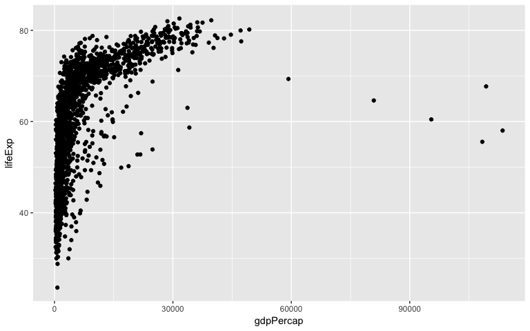
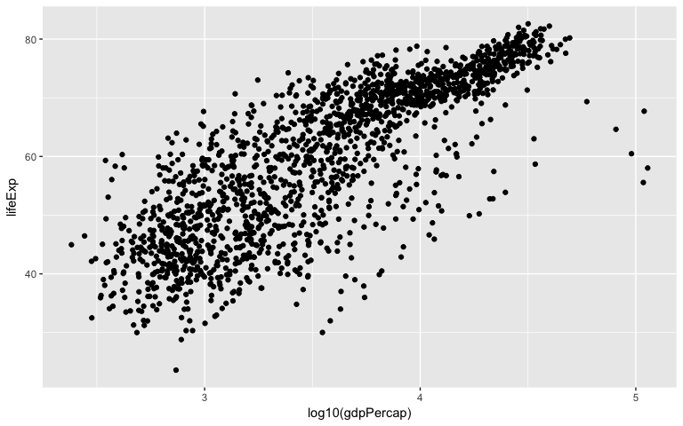
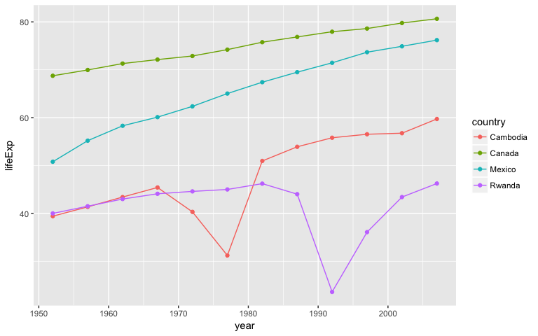
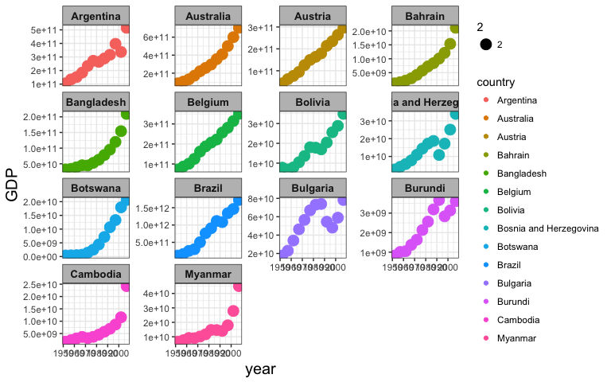
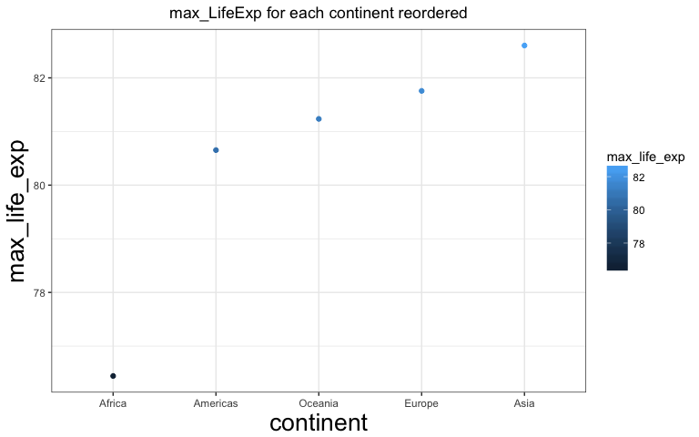
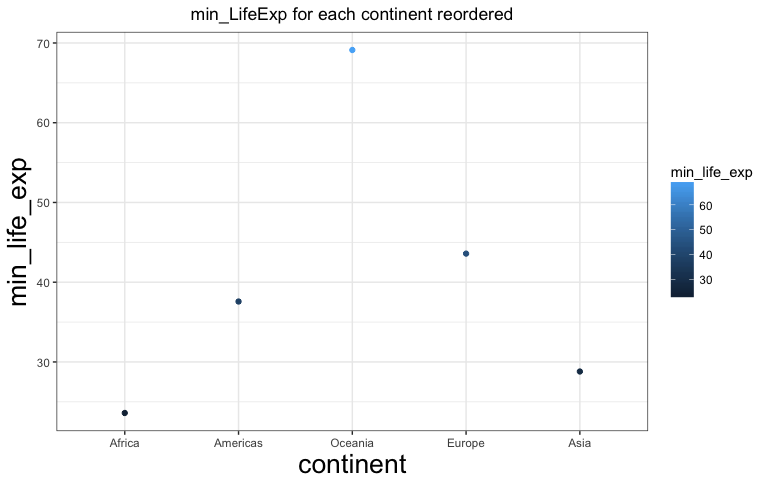
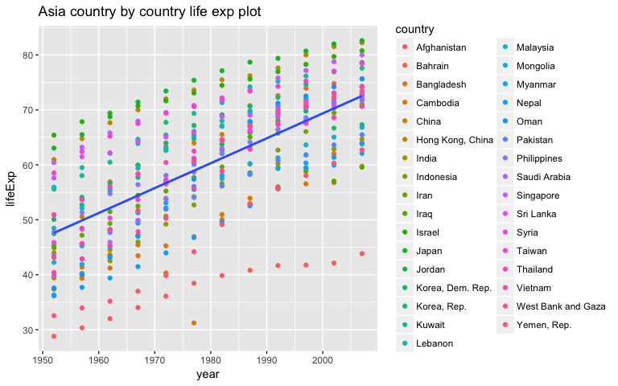
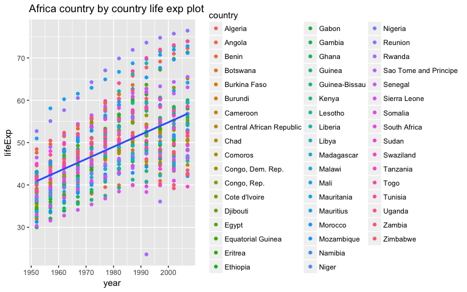
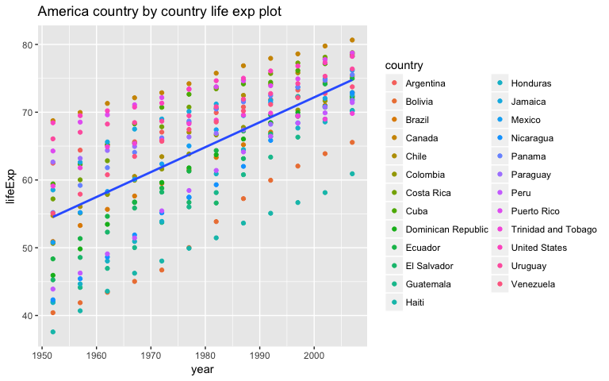
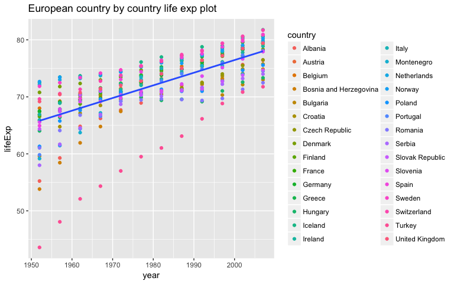

Data wrangling wrap up
================
Jason Sun
2017-11-15

Let's do some work for homework 7
---------------------------------

Initial Setup
-------------

We need to load some dataset first

``` r
suppressPackageStartupMessages(library(gapminder))
suppressPackageStartupMessages(library(tidyverse))
```

    ## Warning: package 'purrr' was built under R version 3.4.2

    ## Warning: package 'dplyr' was built under R version 3.4.2

``` r
suppressPackageStartupMessages(library(dplyr))
suppressPackageStartupMessages(library(ggplot2))
suppressPackageStartupMessages(library(reshape))
suppressPackageStartupMessages(library(tidyr))
suppressPackageStartupMessages(library(stringr))
library(forcats)
library(gapminder)
library(tidyverse)
library(ggplot2)
library(knitr)
library(ggthemes)
library(reshape)
library(tidyr)
library(stringr)
library(downloader)
library(broom)
library(ggmap)
knitr::opts_chunk$set(fig.width=8, fig.height=5)
```

Let's do some work buddy!
-------------------------

``` r
# Download the data first
download.file(url = "https://raw.githubusercontent.com/jennybc/gapminder/master/inst/extdata/gapminder.tsv", destfile = "gapminder.tsv")
download.file(url = "https://raw.githubusercontent.com/jennybc/gapminder/master/inst/extdata/country-codes.tsv", destfile = "countrycode.tsv")

#Get the new dataset

gapminder <- read.delim("gapminder.tsv")
countrycode <- read.delim("countrycode.tsv")
countrycode_result <- left_join(gapminder, countrycode)
```

    ## Joining, by = "country"

    ## Warning: Column `country` joining factors with different levels, coercing
    ## to character vector

``` r
countrycode_result %>% saveRDS("new_dataset.rds")

#Let's do some work

new_dataset = readRDS("new_dataset.rds")

# Let's try to see the scatterplot for the relationship between lifeExp and gdpPercap

scatterplot_lifexp_gdppercap <- ggplot(new_dataset, aes(x = gdpPercap, y = lifeExp)) + geom_point()

scatterplot_lifexp_gdppercap
```



``` r
ggsave("life_exp_hist",scatterplot_lifexp_gdppercap ,device = "png", width = 10, height = 10,dpi = 300)


# Let's try to find out the log10(gdpPerCap) towards lifeExp

scatterplot_log10_lifeexp_gdppercap <- ggplot(new_dataset, aes(x = log10(gdpPercap), y = lifeExp)) + geom_point()

scatterplot_log10_lifeexp_gdppercap
```



``` r
ggsave("scatterplot_log10_lifeexp_gdppercapt",scatterplot_log10_lifeexp_gdppercap ,device = "png", width = 10, height = 10,dpi = 300)

# Let's draw a plot by year with different countries and their respective lifeExp

jCountries <- c("Canada", "Rwanda", "Cambodia", "Mexico")

different_life_exp <- ggplot(subset(new_dataset, country %in% jCountries), aes(x = year, y = lifeExp, color = country)) + geom_line() + geom_point()

different_life_exp
```



``` r
ggsave("different_life_exp",different_life_exp ,device = "png", width = 10, height = 10,dpi = 300)

# I will reorder the avg life expectany by continents in year 2007 from largest to smallest based on their respective average life expectancy

# Make a plot of GDP for country codec between 30 and 120
new_dataset_codec <- new_dataset %>%  filter(iso_num >30 & iso_num <120) %>% ggplot(aes(x = year, y = (gdpPercap*pop)))+ facet_wrap(~ country , scales = "free_y") + geom_point(aes(color = country, size = 2)) + theme_bw() +
theme(strip.background = element_rect(fill="grey"), axis.title.x = element_text(size=15), axis.title.y = element_text(size=15), strip.text = element_text(size=10, face="bold",hjust=0.5)) + scale_y_continuous("GDP")   

new_dataset_codec
```



``` r
ggsave("new_dataset_codec",new_dataset_codec ,device = "png", width = 10, height = 10,dpi = 300)

new_dataset %>% saveRDS("figure.rds")


new_dataset = readRDS("figure.rds")

#Let's do the work 

#Step1: Let's change the order of the new_dataset column

result_reorder_data <- new_dataset %>% mutate(continent = fct_reorder(continent,lifeExp, max))

result_reorder_data %>% saveRDS("reordered_dataset.rds")

#Step2: Plot a plot based on the above result_reorder_data for life_exp

max_life_exp <- result_reorder_data %>% group_by(continent) %>%  summarise(max_life_exp = max(lifeExp)) 
  
ggplot(max_life_exp, aes(x = continent, y = max_life_exp, color = max_life_exp))+ 
geom_point() + theme_bw() + theme(axis.title.x = element_text(size=20), axis.title.y = element_text(size=20), plot.title=element_text(hjust=0.5)) +
labs(title="max_LifeExp for each continent reordered")
```



``` r
ggsave("continent_based_max_life.png")
```

    ## Saving 8 x 5 in image

``` r
min_life_exp <- result_reorder_data %>% group_by(continent) %>%  summarise(min_life_exp = min(lifeExp)) 

ggplot(min_life_exp, aes(x = continent, y = min_life_exp, color = min_life_exp))+ 
  geom_point() + theme_bw() + theme(axis.title.x = element_text(size=20), axis.title.y = element_text(size=20), plot.title=element_text(hjust=0.5)) +
  labs(title="min_LifeExp for each continent reordered")
```



``` r
ggsave("continent_based_min_life.png")
```

    ## Saving 8 x 5 in image

``` r
new_dataset = readRDS("new_dataset.rds")

# Let's do some work
# Let's do the linear regression model
# Fit a linear regression of life expectancy on year within each country. Write the estimated intercepts, slopes, and residual error variance (or sd) to file. The R package broom may be useful here.
# Let's define a function to do the linear regression with lifeExp with year
linear_regression_model <- function(year) {
  lm(lifeExp ~ I(year - 1900), data = year)
}

nest_country <- new_dataset %>% group_by(continent, country) %>% nest()

result <- nest_country %>%  mutate(model = map(data, linear_regression_model), tidy = map(model, tidy)) %>% 
select(continent, country, tidy) %>% unnest(tidy) %>% mutate(term = recode(term, `Interception` = "intercept", `Year Difference` = "slope"))
                                                    

result 
```

    ## # A tibble: 284 x 7
    ##    continent     country           term   estimate   std.error  statistic
    ##       <fctr>       <chr>          <chr>      <dbl>       <dbl>      <dbl>
    ##  1      Asia Afghanistan    (Intercept) 15.5902040 1.663726708   9.370652
    ##  2      Asia Afghanistan I(year - 1900)  0.2753287 0.020450934  13.462890
    ##  3    Europe     Albania    (Intercept) 41.8256009 2.698155750  15.501552
    ##  4    Europe     Albania I(year - 1900)  0.3346832 0.033166387  10.091036
    ##  5    Africa     Algeria    (Intercept) 13.7724289 1.800083981   7.650992
    ##  6    Africa     Algeria I(year - 1900)  0.5692797 0.022127070  25.727749
    ##  7    Africa      Angola    (Intercept) 21.2409811 1.914378218  11.095499
    ##  8    Africa      Angola I(year - 1900)  0.2093399 0.023532003   8.895964
    ##  9  Americas   Argentina    (Intercept) 50.6395995 0.397713488 127.326835
    ## 10  Americas   Argentina I(year - 1900)  0.2317084 0.004888791  47.395847
    ## # ... with 274 more rows, and 1 more variables: p.value <dbl>

``` r
result %>%saveRDS("linear_regression_result.rds")

# Let's now do some plotting to apply the linear regression model into the each continent

asia <- new_dataset %>% filter(continent == "Asia")
  
ggplot(asia, aes(x=year,y=lifeExp)) + geom_point(aes(color = country)) +  geom_smooth(method="lm",se=FALSE) + labs(title="Asia country by country life exp plot")
```



``` r
ggsave("Asia_country_by_country_life_exp_plot.png" )
```

    ## Saving 8 x 5 in image

``` r
africa <- new_dataset %>% filter(continent == "Africa")

ggplot(africa, aes(x=year,y=lifeExp)) + geom_point(aes(color = country)) +  geom_smooth(method="lm",se=FALSE) + labs(title="Africa country by country life exp plot")
```



``` r
ggsave("Africa_country_by_country_life_exp_plot.png" )
```

    ## Saving 8 x 5 in image

``` r
america <- new_dataset %>% filter(continent == "Americas")

ggplot(america, aes(x=year,y=lifeExp)) + geom_point(aes(color = country)) +  geom_smooth(method="lm",se=FALSE) + labs(title="America country by country life exp plot")
```



``` r
ggsave("America_country_by_country_life_exp_plot.png" )
```

    ## Saving 8 x 5 in image

``` r
europe <- new_dataset %>% filter(continent == "Europe")

ggplot(europe, aes(x=year,y=lifeExp)) + geom_point(aes(color = country)) +  geom_smooth(method="lm",se=FALSE) + labs(title="European country by country life exp plot")
```



``` r
ggsave("European_country_by_country_life_exp_plot.png" )
```

    ## Saving 8 x 5 in image

``` r
# Let's find out the best 4 and worst 4 countries for each continent and I will use the stderr to do the judgement

Asia_good <- result %>%  filter(continent == "Asia") %>% arrange(std.error) %>%  head(3L)
knitr::kable(Asia_good)
```

| continent | country   | term           |   estimate|  std.error|  statistic|  p.value|
|:----------|:----------|:---------------|----------:|----------:|----------:|--------:|
| Asia      | Israel    | I(year - 1900) |  0.2671063|  0.0061169|   43.66662|        0|
| Asia      | Pakistan  | I(year - 1900) |  0.4057923|  0.0067390|   60.21549|        0|
| Asia      | Indonesia | I(year - 1900) |  0.6346413|  0.0107967|   58.78112|        0|

``` r
Asia_bad <- result %>%  filter(continent == "Asia") %>% arrange(desc(std.error)) %>%  head(3L)
knitr::kable(Asia_good)
```

| continent | country   | term           |   estimate|  std.error|  statistic|  p.value|
|:----------|:----------|:---------------|----------:|----------:|----------:|--------:|
| Asia      | Israel    | I(year - 1900) |  0.2671063|  0.0061169|   43.66662|        0|
| Asia      | Pakistan  | I(year - 1900) |  0.4057923|  0.0067390|   60.21549|        0|
| Asia      | Indonesia | I(year - 1900) |  0.6346413|  0.0107967|   58.78112|        0|

``` r
europe_good <- result %>%  filter(continent == "Europe") %>% arrange(std.error) %>%  head(3L)
knitr::kable(europe_good)
```

| continent | country     | term           |   estimate|  std.error|  statistic|  p.value|
|:----------|:------------|:---------------|----------:|----------:|----------:|--------:|
| Europe    | Sweden      | I(year - 1900) |  0.1662545|  0.0035418|   46.94090|        0|
| Europe    | Switzerland | I(year - 1900) |  0.2222315|  0.0035944|   61.82783|        0|
| Europe    | France      | I(year - 1900) |  0.2385014|  0.0036802|   64.80579|        0|

``` r
europe_bad <- result %>%  filter(continent == "Europe") %>% arrange(desc(std.error)) %>%  head(3L)
knitr::kable(europe_bad)
```

| continent | country                | term        |  estimate|  std.error|  statistic|  p.value|
|:----------|:-----------------------|:------------|---------:|----------:|----------:|--------:|
| Europe    | Montenegro             | (Intercept) |  47.00556|   3.746867|   12.54530|    2e-07|
| Europe    | Bulgaria               | (Intercept) |  58.16149|   3.413907|   17.03664|    0e+00|
| Europe    | Bosnia and Herzegovina | (Intercept) |  39.90229|   3.070421|   12.99571|    1e-07|

``` r
america_good <- result %>%  filter(continent == "Americas") %>% arrange(std.error) %>%  head(3L)
knitr::kable(america_good)
```

| continent | country   | term           |   estimate|  std.error|  statistic|  p.value|
|:----------|:----------|:---------------|----------:|----------:|----------:|--------:|
| Americas  | Canada    | I(year - 1900) |  0.2188692|  0.0041686|   52.50378|        0|
| Americas  | Argentina | I(year - 1900) |  0.2317084|  0.0048888|   47.39585|        0|
| Americas  | Brazil    | I(year - 1900) |  0.3900895|  0.0054562|   71.49417|        0|

``` r
africa_bad <- result %>%  filter(continent == "Africa") %>% arrange(desc(std.error)) %>%  head(3L)
knitr::kable(africa_bad)
```

| continent | country   | term        |  estimate|  std.error|  statistic|    p.value|
|:----------|:----------|:------------|---------:|----------:|----------:|----------:|
| Africa    | Zimbabwe  | (Intercept) |  60.05833|   9.803717|   6.126078|  0.0001118|
| Africa    | Swaziland | (Intercept) |  41.44397|   9.039958|   4.584531|  0.0010036|
| Africa    | Rwanda    | (Intercept) |  45.12519|   8.923189|   5.057069|  0.0004941|

``` r
africa_good <- result %>%  filter(continent == "Africa") %>% arrange(std.error) %>%  head(3L)
knitr::kable(africa_good)
```

| continent | country           | term           |   estimate|  std.error|  statistic|  p.value|
|:----------|:------------------|:---------------|----------:|----------:|----------:|--------:|
| Africa    | Equatorial Guinea | I(year - 1900) |  0.3101706|  0.0054973|   56.42252|        0|
| Africa    | Mauritania        | I(year - 1900) |  0.4464175|  0.0068159|   65.49636|        0|
| Africa    | Comoros           | I(year - 1900) |  0.4503909|  0.0080053|   56.26165|        0|

``` r
asia_bad <- result %>%  filter(continent == "Asia") %>% arrange(desc(std.error)) %>%  head(3L)
knitr::kable(asia_bad)
```

| continent | country          | term        |  estimate|  std.error|  statistic|    p.value|
|:----------|:-----------------|:------------|---------:|----------:|----------:|----------:|
| Asia      | Cambodia         | (Intercept) |  16.42848|   7.660379|   2.144604|  0.0575862|
| Asia      | Iraq             | (Intercept) |  37.88252|   5.520090|   6.862662|  0.0000439|
| Asia      | Korea, Dem. Rep. | (Intercept) |  38.45142|   5.290257|   7.268346|  0.0000270|

``` r
asia_good <- result %>%  filter(continent == "Asia") %>% arrange(std.error) %>%  head(3L)
knitr::kable(asia_good)
```

| continent | country   | term           |   estimate|  std.error|  statistic|  p.value|
|:----------|:----------|:---------------|----------:|----------:|----------:|--------:|
| Asia      | Israel    | I(year - 1900) |  0.2671063|  0.0061169|   43.66662|        0|
| Asia      | Pakistan  | I(year - 1900) |  0.4057923|  0.0067390|   60.21549|        0|
| Asia      | Indonesia | I(year - 1900) |  0.6346413|  0.0107967|   58.78112|        0|

Personal Thought
----------------

This work is not much difficult even though it requires some hard work and time to figure out how to best organize your makefile. This homework is very useful because it helps to understand how to work with makefile and how to automate the process for multiple files to run in sequentia order. I like the homework a lot.
